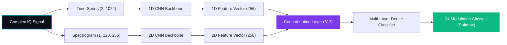
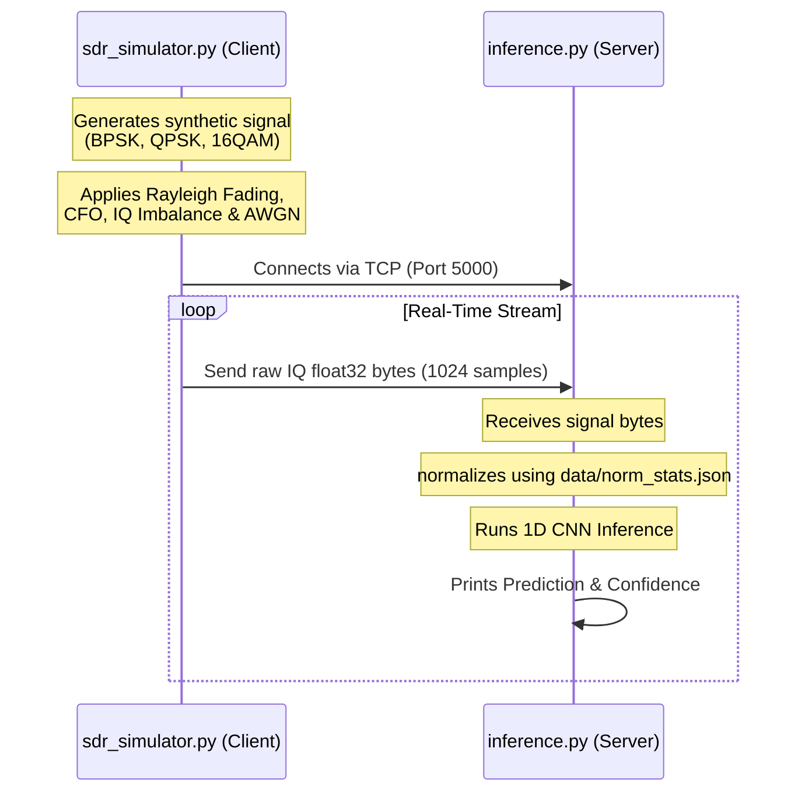

# ⚡ Deep Learning RF Modulation Classifier

A comprehensive, high-performance deep learning pipeline and live-streaming framework for classifying Radio Frequency (RF) signal modulations. This project implements multiple state-of-the-art neural network architectures, pre-processes standard datasets efficiently, provides an SDR socket simulator, and features a premium dark-themed desktop interface for real-time predictions.

---

## 🏗️ System Architecture

The following diagram illustrates the end-to-end flow of the project, spanning lazy data loading, model training, feature-fusion evaluation, live SDR streaming, and desktop visualization:

```mermaid
graph TD
    %% Dataset Prep Phase
    subgraph Data Processing Pipeline
        A["RadioML 2018.01A Dataset (HDF5)"] -->|prepare_rml2018.py| B["SNR Filtering & Stratification"]
        B --> C["z-Score Normalization Statistics"]
        B --> D["Splitting (70% Train, 15% Val, 15% Test)"]
        D -->|Save NumPy Index Files| E["data/ (*_indices.npy, labels, SNRs)"]
    end

    %% Model Architectures
    subgraph Model Training Suite
        E -->|Raw 1D IQ Sequence| F["train_1d_cnn.py"]
        E -->|STFT Spectrogram Conversion| G["train_2d_cnn.py"]
        F -->|Extracts 1D Feature Vectors| H["train_hybrid.py (Fusion Head)"]
        G -->|Extracts 2D Spectrogram Features| H
        H -->|Best Models Saved| I["models/ (*_best.pth)"]
    end

    %% Inference & Streaming Phase
    subgraph Deployment & Visualization
        I -->|PyTorch Weight Checkpoints| J["gui.py (Dark-Theme Desktop App)"]
        I -->|ONNX Compile Graph| K["export_onnx.py"]
        
        subgraph Real-Time Socket Stream
            L["sdr_simulator.py (Fading + Offset + Noise)"] -->|TCP Stream (Port 5000)| M["inference.py (Pi/Server Receiver)"]
        end
        
        M -->|Load Weights & Predict| N["Real-time Console Diagnostics"]
        J -->|Load Signal / Live Predict| O["Matplotlib Probabilities Display"]
    end

    classDef stage fill:#1a1a2e,stroke:#7c3aed,stroke-width:2px,color:#e2e8f0;
    class A,E,I,J,L,M stage;
```

---

## 🧠 Model Architectures

This project implements three distinct architectures in **PyTorch**:

### 1. 1D CNN Architecture
* **Inputs**: Raw IQ sequences with shape `(2, 1024)`.
* **Flow**: Features are extracted using sequential 1D convolutional layers with batch normalization and MaxPool layers. Global Average Pooling (GAP) aggregates these features into a vector of size `256`, which is then passed to a fully-connected classifier head.
* **Focus**: Fast inference, capture of raw phase/amplitude transitions over time.

### 2. 2D CNN Spectrogram Architecture
* **Inputs**: 2D STFT Spectrograms with shape `(1, 128, 256)` derived from raw complex signals.
* **Flow**: Uses Scipy's Short-Time Fourier Transform (STFT) to map time-domain transitions into spatial-frequency spectrograms, normalizing the outputs. These are processed by consecutive 2D convolutional blocks and max-pooling, ending in a Global Average Pooling layer and classification head.
* **Focus**: High noise resistance, leveraging frequency-domain signatures.

### 3. Hybrid Feature Fusion Model
* **Inputs**: Joint raw IQ sequences and 2D Spectrograms.
* **Flow**: Combines trained 1D CNN and 2D CNN feature extractors. The features output from the respective pooling layers are concatenated (size `512`) and fed into a dense multi-layer fusion classifier head.



---

## 📂 Repository Structure

```bash
├── data/                  # Metadata configurations & processed split indices (NPY files gitignored)
│   ├── class_names.json   # Supported modulation types (24 classes)
│   └── norm_stats.json    # Channel-wise normalization statistics
├── models/                # PyTorch check-point binaries (*.pth gitignored)
├── prepare_rml2018.py     # Efficient dataset loader, SNR filter & train/val/test splitter
├── train_1d_cnn.py        # 1D-CNN Model Trainer
├── train_2d_cnn.py        # 2D-CNN Spectrogram Trainer
├── train_hybrid.py        # Multi-Architecture Feature Fusion Trainer
├── export_onnx.py         # PyTorch-to-ONNX graph exporter
├── sdr_simulator.py       # Simulated SDR stream generator with fading/channel noise
├── inference.py           # Stream receiver and socket inference script
├── gui.py                 # Sleek desktop Tkinter prediction environment
└── requirements.txt       # Project python dependencies
```

---

## ⚡ Live SDR Simulation & Streaming

The project contains a complete server-client simulation module. You can simulate an active **Software Defined Radio (SDR)** transmitter streaming IQ data over TCP to an inference receiver (e.g., representing a Raspberry Pi or local server).

* **Channel Degradation**: `sdr_simulator.py` simulates real-world environments by applying:
  * **Rayleigh Fading** (multipath interference)
  * **Carrier Frequency Offset (CFO)**
  * **IQ Imbalance** (gain offset)
  * **AWGN Noise** (user-defined SNR values)



---

## 🚀 Setup & Installation

### 1. Prerequisite Installations
Ensure you have python 3.10+ installed. Clone the repository and install all required modules:
```bash
pip install -r requirements.txt
```

### 2. Download the Dataset
This pipeline is optimized for the **RadioML 2018.01A** dataset (consisting of HDF5 data containing IQ signals, one-hot labels, and SNR indicators).
* Obtain the HDF5 dataset file (`GOLD_XYZ_OSC.0001_1024.hdf5`).
* Keep the dataset outside this project folder (or within a secure, ignored directory) to maintain repository speed.

---

## 💻 Usage Guide

### Step 1: Pre-process & Filter Dataset
Run the memory-efficient preparation script to filter dataset samples with SNR $\ge$ 0 dB, split them into stratified folds, and compute normalization stats:
```bash
python prepare_rml2018.py --dataset /path/to/GOLD_XYZ_OSC.0001_1024.hdf5 --out_dir ./data --min_snr 0
```

### Step 2: Run End-to-End Training
You can train each model individually or trigger the unified orchestration pipeline script:
```bash
python run_pipeline.py --dataset /path/to/GOLD_XYZ_OSC.0001_1024.hdf5 --data_dir ./data --save_dir ./models --epochs 50
```

### Step 3: Run the Desktop GUI
Open the premium, custom dark-themed Tkinter GUI. You can load a trained model, load native IQ signals (`.npy`), or generate random signals to run inference and visualize probability distributions:
```bash
# Launch default app
python gui.py

# Pre-load specific checkpoint
python gui.py --model ./models/1d_cnn_best.pth --arch 1d
```

### Step 4: Run Real-time Streaming Simulation
Simulate a live SDR client feeding an offline model processor over TCP:

1. **Start the Receiver / Server**:
   ```bash
   python inference.py --model ./models/1d_cnn_best.pth --stream --host 127.0.0.1 --port 5000
   ```
2. **Start the Simulator / Transmitter**:
   ```bash
   python sdr_simulator.py --pi_ip 127.0.0.1 --port 5000 --snr 12
   ```

---

## 📈 Performance Summary

*Predefined placeholders for minor-project validation:*

| Architecture | Test Accuracy | Avg. Latency (ms) | Key Features |
|:---|:---:|:---:|:---|
| **1D CNN** | ~--% | ~1.5 ms | High-speed, sequential spatial mapping |
| **2D CNN** | ~--% | ~4.2 ms | Robust spectrogram-based noise resistance |
| **Hybrid Fusion** | **~--%** | ~5.8 ms | Combined time-frequency multimodal fusion |

---

## 🛡️ License & Copyright
Developed as a University Minor Project. All rights reserved. Code is distributed for educational and assessment purposes.
